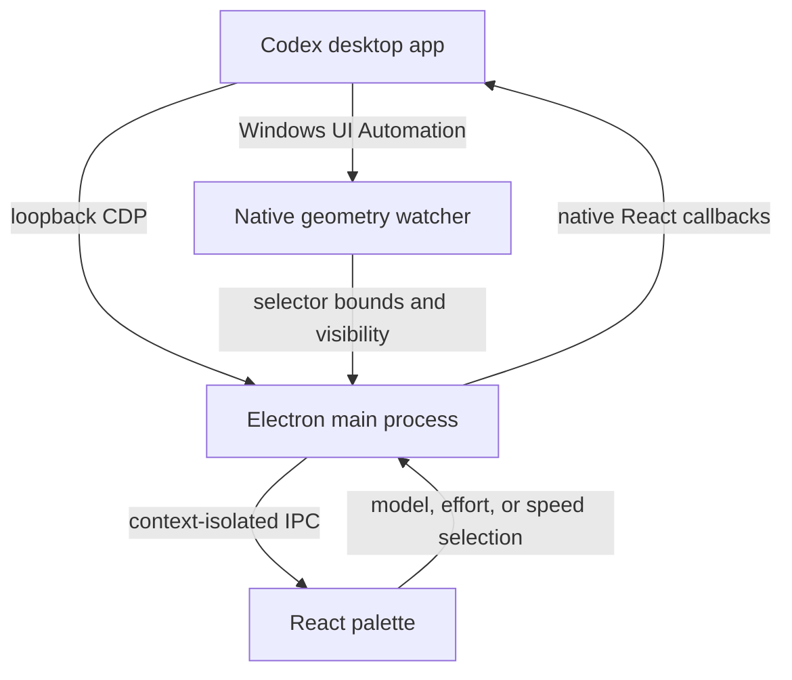

# Architecture

Codex Palette Overlay is a small Electron application with a React renderer and a Windows PowerShell helper.

## Runtime overview

## Electron main process

`electron/main.ts` owns the transparent always-on-top window, selector anchoring, CDP discovery, keyboard-shortcut registration, IPC handlers, and lifecycle management.

The expanded window is anchored to the bottom-right corner of the native selector. Its lower-right cutout remains transparent so the real Codex selector stays visible while the overlay maps clicks in that area to its own open/close action.

## Renderer bridge

`electron/preload.ts` exposes a narrow, context-isolated API. The React renderer can request a selection, change the speed tier, move the overlay, and receive selector presentation or task-selection updates. Node.js is not exposed to the page.

## React palette

`src/App.tsx` renders the model/effort matrix and the two-position speed control. Model capabilities come from Codex; unsupported cells are disabled. The renderer stores only its last visual selection and is corrected whenever the native task state changes.

## CDP integration

`electron/codex-cdp.ts` contains small expression builders and a minimal Chrome DevTools Protocol transport.

The discovery path reads:

- the visible model catalog;
- supported reasoning efforts and service tiers;
- localized restart strings;
- selector geometry and computed style;
- current model, effort, and speed state;
- the configured model-selector shortcut.

The modifier path locates the React props already connected to the native selector and invokes `onSelectModel` or `onSelectServiceTier`. It then waits for the native props to reflect the requested value before reporting success.

No task identifier is constructed or sent by the palette.

## Native geometry watcher

`electron/native-overlay.ps1` uses Windows UI Automation to find the closed model selector, read its bounds, and track whether Codex or the overlay is in the foreground.

The watcher caches:

- the Codex process;
- the process identifier;
- the selector AutomationElement.

The 350 ms loop reads bounds, accessible name, and foreground state from the cached objects. A full selector search occurs only when the process or native element changes.

## Fallbacks

Legacy UI Automation menu scanning and modification still exist for compatibility testing, but both are opt-in through environment variables. The default path never opens the native model menu.

## Trust boundary

The CDP endpoint binds to `127.0.0.1` and uses a random port. CDP can inspect and execute code in the Codex renderer, so the palette deliberately keeps each expression narrow and returns only selector metadata or selection confirmation.

Users should treat any local process running under the same Windows account as trusted while Codex is running with CDP enabled.
